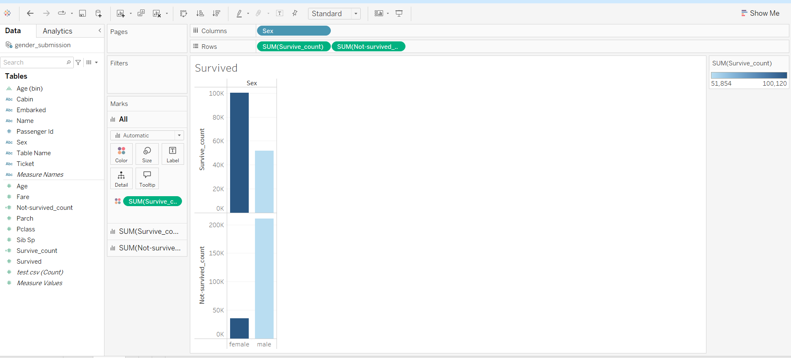

# Population Demographics Visualization Project

## Project Overview

This project visualizes population demographics by creating bar charts and histograms to analyze the composition of different age groups and survival rates based on demographic data. Using Tableau, the project highlights the distribution of ages and survival status by gender.

## Visualizations

### 1. Age Distribution Histogram
The histogram below displays the distribution of ages in the dataset, showing the frequency of different age groups. This visualization is useful for understanding the age composition in the population.


### 2. Survival Count by Gender
The bar chart shows the survival count categorized by gender. It provides insights into survival rates for males and females, which may reveal important trends in demographic survivability.



## Goals

- **Analyze Age Distribution**: Explore the frequency of various age groups in the population.
- **Examine Survival Rates**: Visualize survival counts by gender to understand gender-based survival trends.
- **Gain Demographic Insights**: Use the visualizations to better understand population demographics.

## Features

- **Histogram**: Displays age distribution across different bins.
- **Bar Chart**: Visualizes survival counts for males and females, revealing possible survival trends.
  
## Technologies Used

- **Data Visualization**: Tableau was used to create both the histogram and bar chart.

## Getting Started

1. **Clone the Repository**:
   ```bash
   git clone https://github.com/your-username/your-repo-name.git
